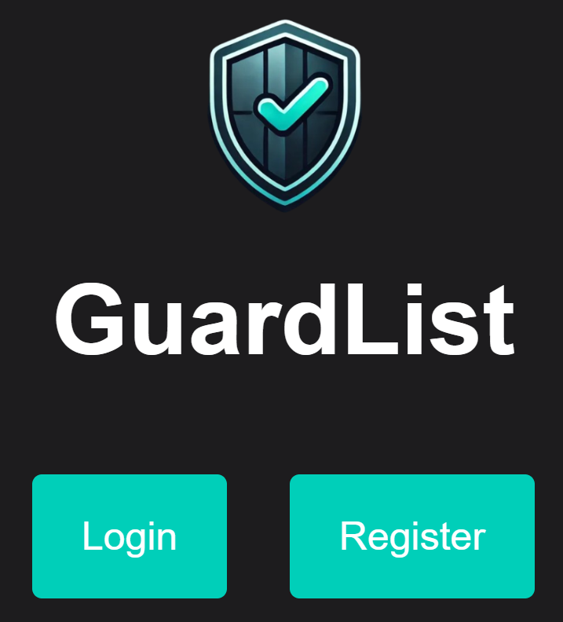
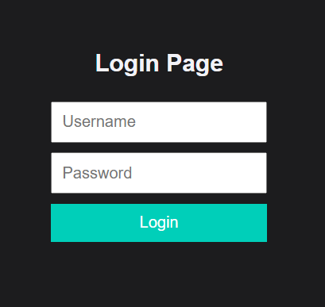
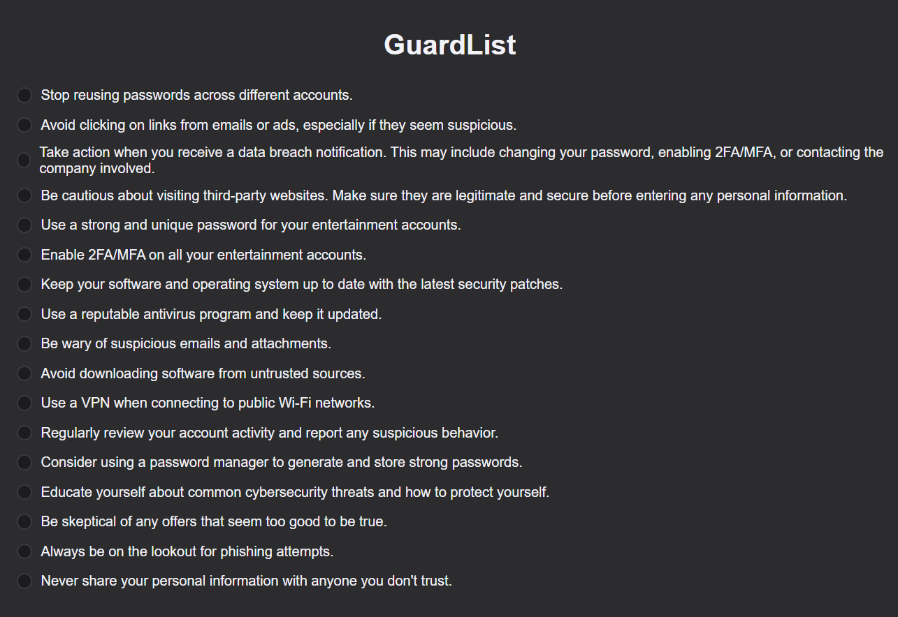
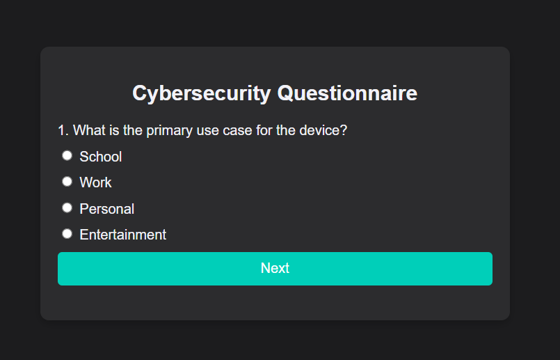

  

  <h1>GuardList</h1>
  
 One major problem with the digital world is that people often struggle with maintaining a safe digital environment. Cyberly is a cybersecurity checklist, personalized to help each user maintain their safety online. 

  

  
  
  

[Website Link](https://guardlist.co/)

## What Is GuardList?
An innovative cybersecurity website that uses HTML, JavaScript, and CSS to give an intuitive cybersecurity checklist that gives users suggestions on how to improve their safety online. Using a quick questionnaire answered by the user, we use generative AI to provide a personalized checklist for the user to follow. This checklist guides users to follow and create a safer cyber environment for themselves.

## Features
* **Questionnaire:** There is an interactive questionnaire asking the user about their online actions and their impact.
* **Generative AI:** Using the questionnaire, we used Gemini's API to create a live, personalized checklist for each user.

## Contributors
* [Daniyal (@Daniyal-Danish)](https://github.com/Daniyal-Danish)
* [Krish (@KR1-SH)](https://github.com/KR1-SH)
* [Alan (@AK2526)](https://github.com/AK2526)
* [Dev (@Devptll)](https://github.com/Devptll)

## Technologies Used
### Frontend
* **JavaScript**
* **HTML**
* **CSS**

### Backend
* **JavaScript**
* **Gemini API**
